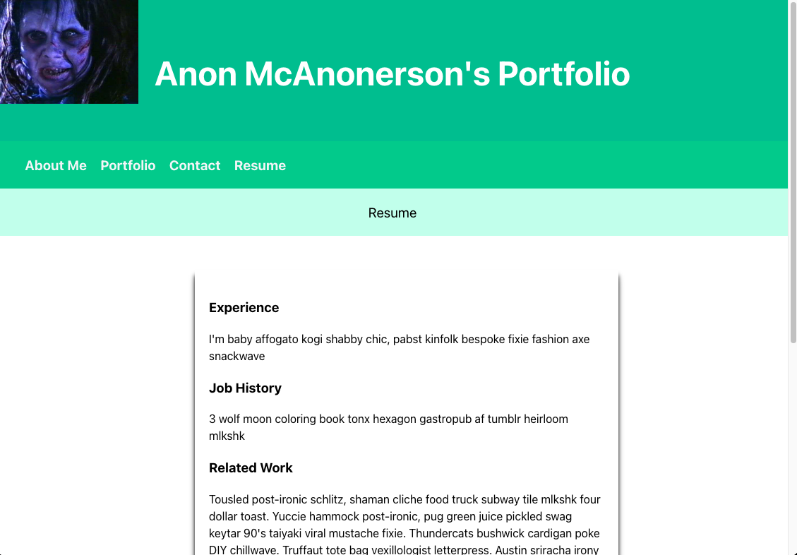

# Portfolio

 ## Table of Contents

 - [Description](#Description)
 - [Installation](#Installation)
 - [Usage](#Usage)
 - [Contribution](#Contribution)
 - [Tests](#Tests)
 - [License](#License)
 - [Questions](#Questions)

 ## Description

This is a portfolio page for class project.

[Deployed](https://anon123123123.github.io/du-react-portfolio/)

 
(<a href="#Portfolio">back to top</a>)

 
 ## Built with

- ReactJS
- HTML
- CSS

 
(<a href="#Portfolio">back to top</a>)

 ## Contact

[Github](https://github.com/anon123123123)

 
(<a href="#TEST">back to top</a>)

 